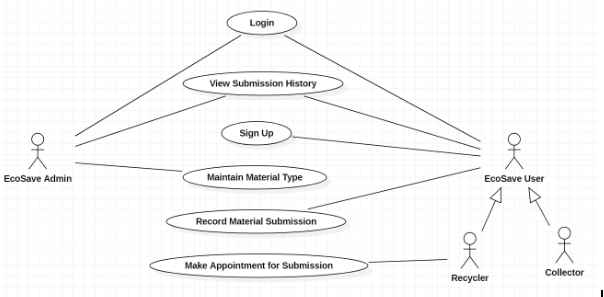
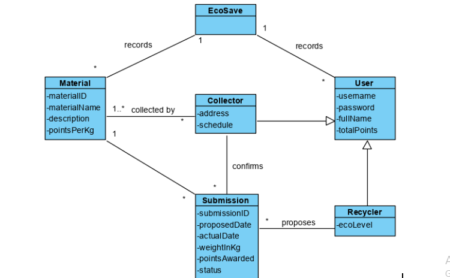
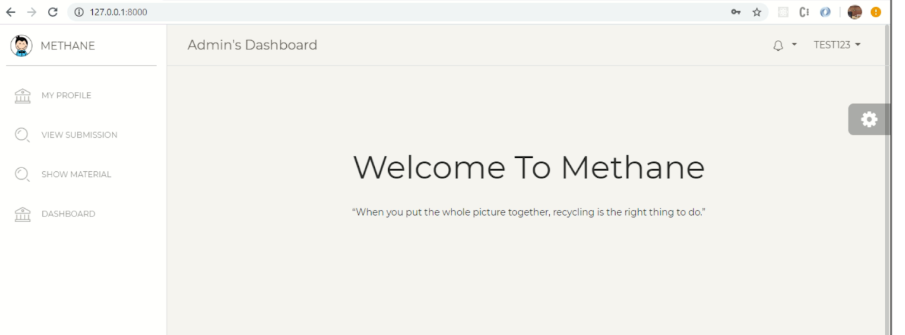

# Methane Web application
----

Methane is a web-based platform that encourages people to recycle more by smoothing over the process of communication between Recyclers and Collectors. 

### Project Objectives 

- Provide a straightforward and simple user interface
- Allow for the submission and confirmation of recycled items.
- Reward collectors and recyclers for their contribution.
---
  

<h5 align="center">  Use Case Diagram </h5> 

 

<h5 align="center">  Analysis Class Diagram</h5> 

 

<h5 align="center"> Admin Dashboard </h5>

 
----

### How to Contribute 

The system is not complete without some kind of reward for the user. Voucher system can be implemented to allow users to use the voucher to purchase or receive a discount on recyclable items that can be bought in convenience stores or supermarkets. The admin will need to create these vouchers. The two use cases will be as follows:

- Admin - Maintain Voucher
- Collector & Recycler - Redeem Voucher 
 
